# Mock LinkedIn CLI

Mock LinkedIn program that is run in the command line. It can perform actions such as logging in with a username and password, adding or removing connections, and adding or removing skills from your profile. 

## Lessons Learned
- advanced Java syntax
- first time using recursion for the degree of separation

## Usage
The program can be run in the command line.  
  
User actions:
- sign in to your account with a username and password
- create or delete a user profile
- add, remove, and list your connections
- view the degree of separation between you and another user
- list all users sorted alphabetically or by number of connections
- list all users sorted by account types: P (premium) or S (simple)
- add, remove, and list your skillsets  

**Screenshots of it working:**

Logging in, password verification, and main menu:  
  
  
List all users:  
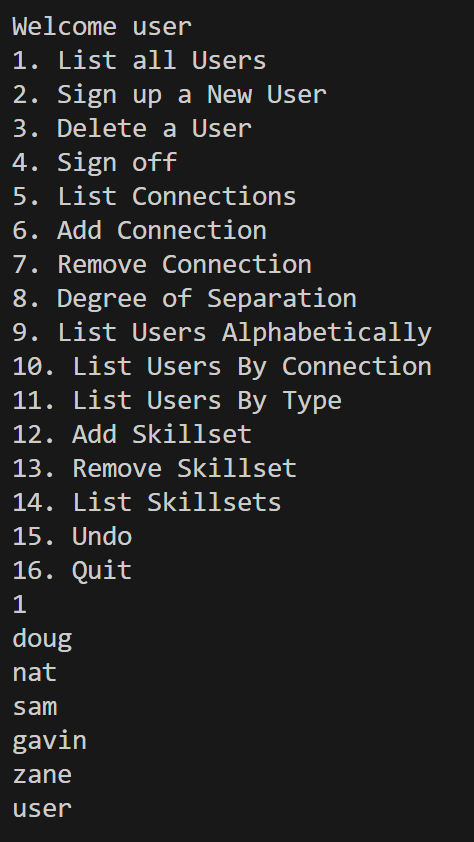  

Sign up new user:  
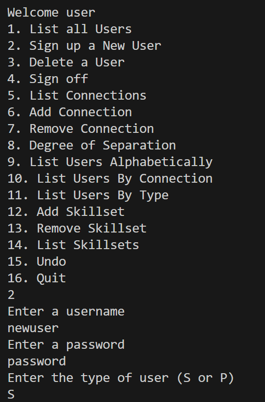

Delete a user by providing their username and password:  
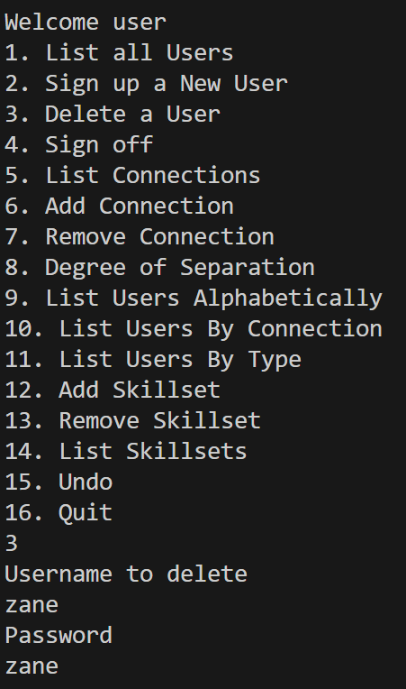
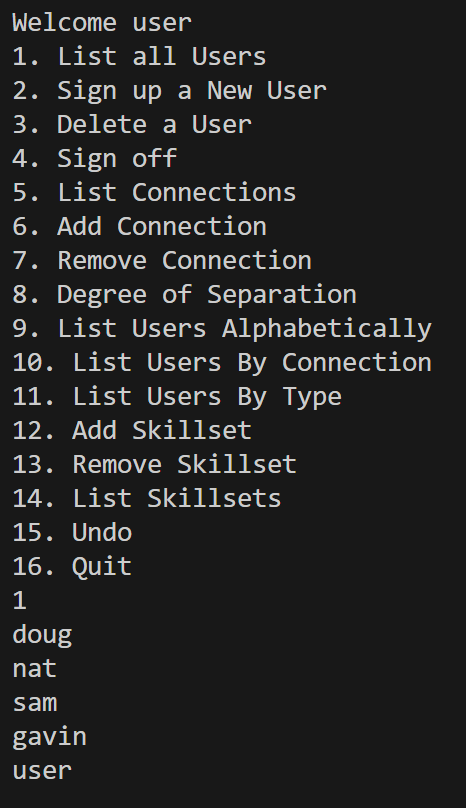  

Add a connection:  
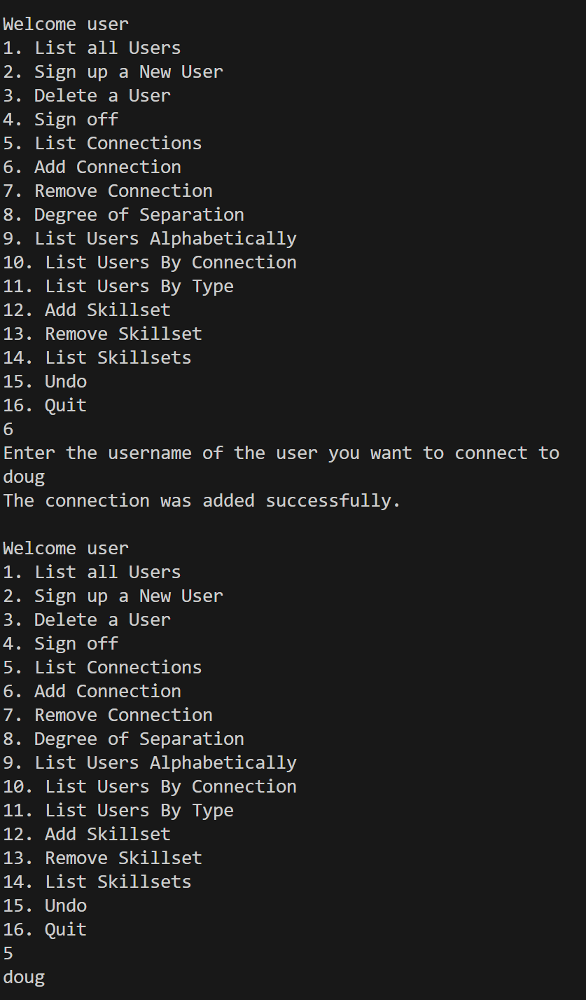  

View the degree of separation to another user:  
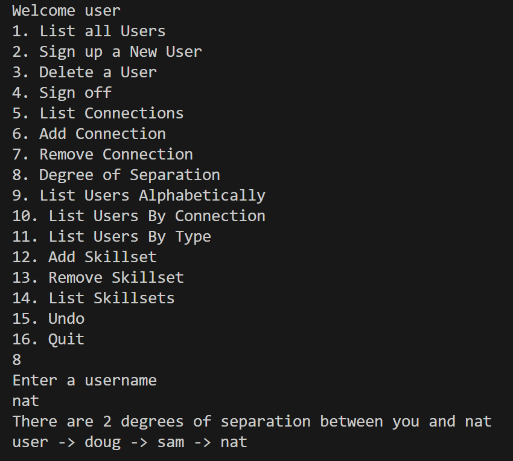 

View all users sorted alphabetically:  
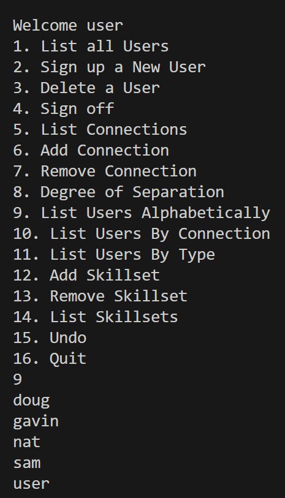  

View all users sorted by number of connections:  
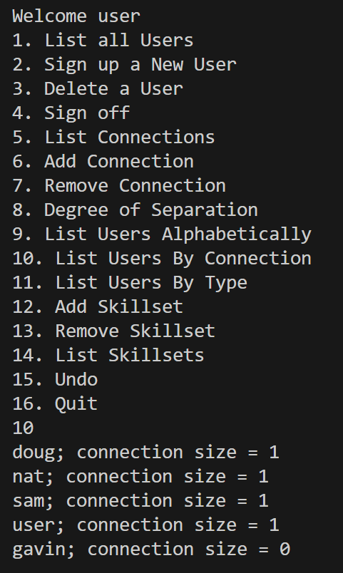  

View all users sorted by account type:  
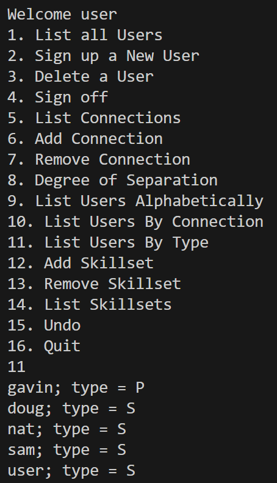  

Add a skillset to your profile:  
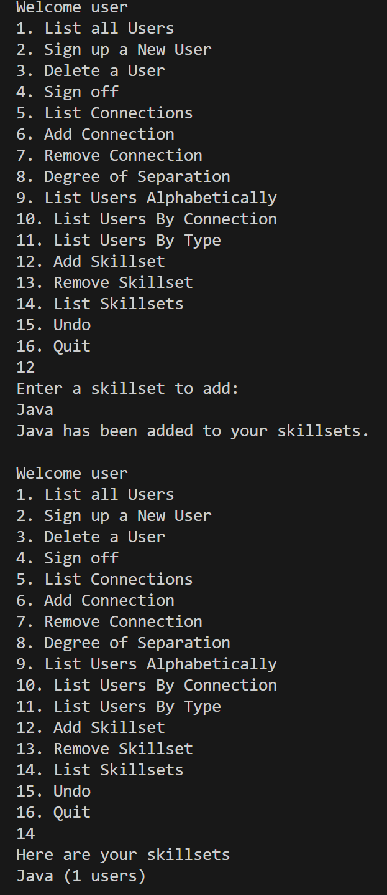  

Sign off:  
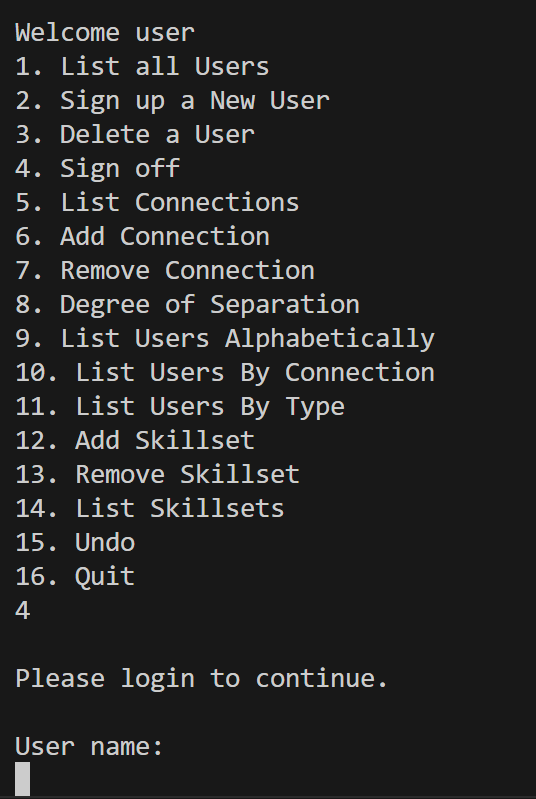  

