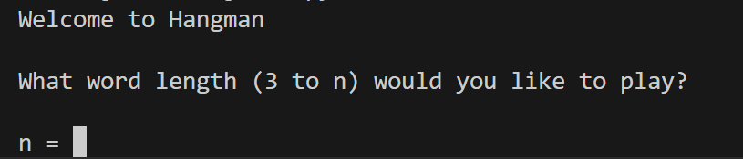
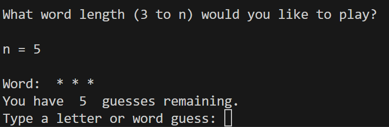
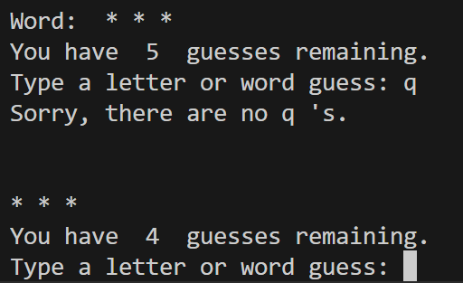
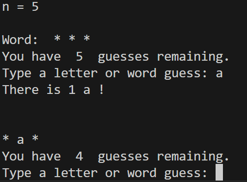
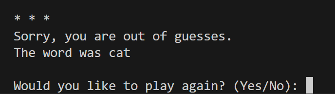
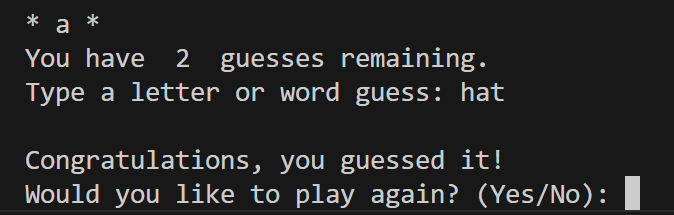

# Hangman Game

This Python program uses a list of words from wordlist.txt to play a game of hangman. The minimum length of the word to be guessed is 3 letters, and the max length is 10 letters.

## Lessons Learned
- Python syntax
- accessing files using "with open" in Python
- python try / except statements

## Usage
Navigate to the project folder in your terminal to run the file with access to the word list text file.  
  
The user selects the max word length (minimum of 3). The number of guesses allowed is (word length * 2) - 1.  

On each turn, the user can use a guess to try to find a letter in the word, or guess the word. If the program detects a guess who's length is greater than 1 (for a one letter guess) but less than the word length, it will prompt the user again.  

If the user guesses the word before running out of guesses, they win. If they run out of guesses, they lose.  
  
**Screenshots of it working**
The start of the game. User is prompted for max word length:  
  

Number of guesses is determined by (n * 2) - 1, and the word is displayed with asteriks:  
  

Incorrect Letter Guess:  
  

Correct Letter Guess:  
  

Game Loss, correct word is displayed:  
  

Game Win:  
  
