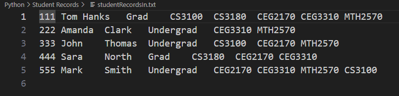
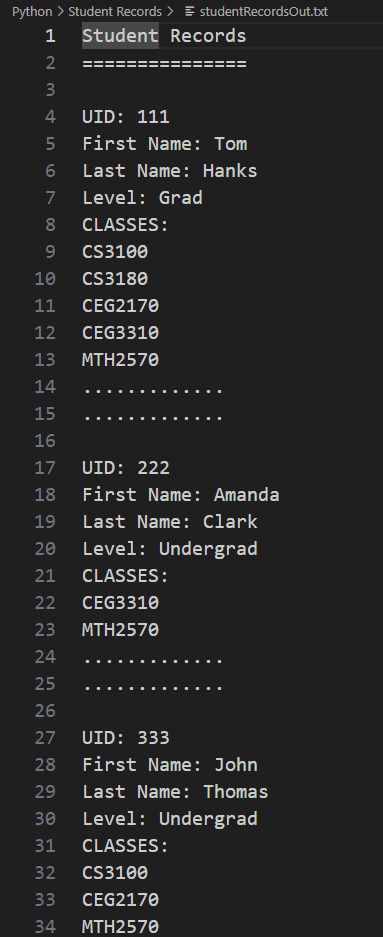

# Student Records

This Python program takes in information from studentRecordsIn.txt, organizes it by each variable, and outputs it to the console as well as studentRecordsOut.txt in an format that is easy to read.

## Lessons Learned
- Python syntax
- how to store information from a separate file as different variables
- Python classes
- Python iterators

## Usage
Run the program with studentRecordsIn.txt located in the project folder. The output will be shown in the console as well as studentRecordsOut.txt.

## Screenshots of it Working
Input file:  
 

Output file:  
