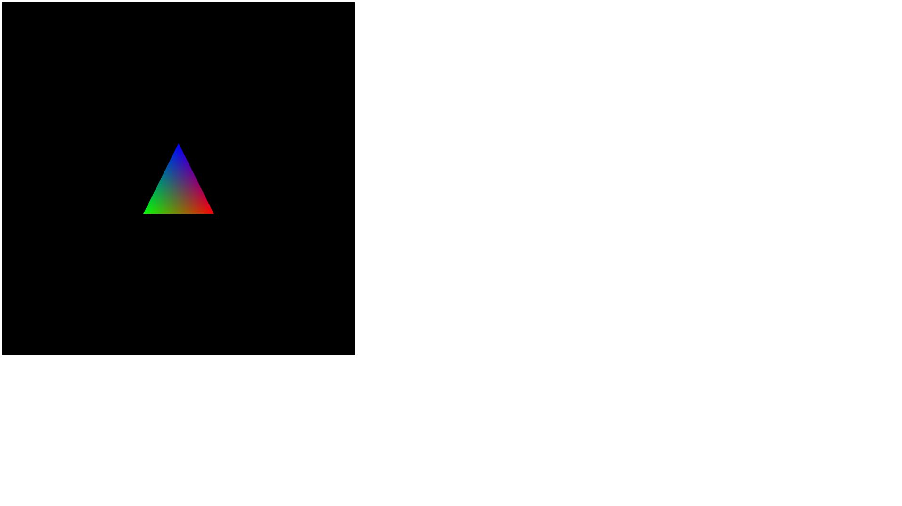

# 3D Graphics with WebGL

This program renders and animates a tetrahedron on a canvas space. The user is able to rotate, translate, and scale it using key presses.

## How it works
3DShapes.html sets up the shaders with multiple 4x4 matrices.
Mx, My, and Mz are rotation matrices for the x, y, and z axes respectively.
Mt is the translation matrix.
Ms is the scaling matrix.
Onkeydown and onkeyup both point to functions in 3DShapes.js 
that will stop or start a translation based on a boolean.

3DShapes.js sets up a tetrahedron that is rainbow colored.
Animations for the tetrahedron are handled in the render() function.
There are several variables that will change the tetrahedron in each render() call.

alpha, beta, and zeta determine the angle that the shape should be pointing on the x, y, and z axes respectively.
moveX, moveY, and moveZ determine whether or not the tetrahedron should be rotating around the x,y, or z axes respectively.

txJS, tyJS, and tzJS determine where the tetrahedron should be on the x, y, and z axes respectively.
xDirection and yDirection determine if the tetrahedron shoulf be moving on the x or y axes respectively.

sxJS, syJS, and szJS determine the amount of scaling on each respective axis.
xScaling and yScaling determine if the scaling on the x or y axis should be changing.

All of these variables update their respecitve matrices in the shader.
Each matrix is then multiplied together in the shader to move the tetrahedron to where it is supposed to be.

The order that the matrices are multiplied together matters. 
Different orders would mean a different order for multiple translations to occur.

Currently, the order is scaling, rotation, translation.
I like the order because when rotating and translating at the same time, 
it stays closer to the origin for longer. Scaling is first because when the scaling matrix is applied later, the tetrahedron becomes a 2D shape.

The speed for each translation is set at 0.025, 
which seems like a relatively slow speed that also moves fast enough to see the results quickly

## Lessons Learned
- HTML syntax
- JavaScript syntax
- 3D shape creation
- 3D animations including transformation, scaling, and rotation on multiple axes 

## Usage
Open 3DShapes in a browser.  

Key Presses:
x: rotate on x axis
y: rotate on y axis
z: rotate on z axis
w: positive y axis movement
s: negative y axis movement
d: positve x axis movement
a: negative x axis movement
up arrow: positive y axis scaling
down arrow: negative y axis scaling
right arrow: positive x axis scaling
left arrow: negative x axis scaling

r: reset the shape to the beginning location and orientation

**Screenshots of it working**
Start the program:  
  

Translate on X and Y axes respectively:  
 
   

Rotation on X, Y, and Z axes respectively:  

   
  

Scaling on X and Y axes:  
 

## Known bugs
- the shape setup is slightly incorrect, so it is possible to see into or through the shape when rotating, but the general shape can still be determined
- resetting the shape (r) increases animation speed